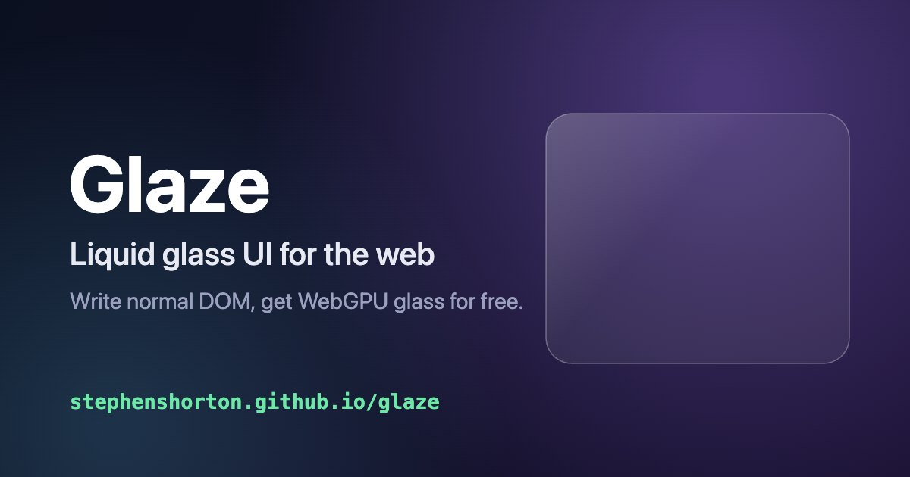
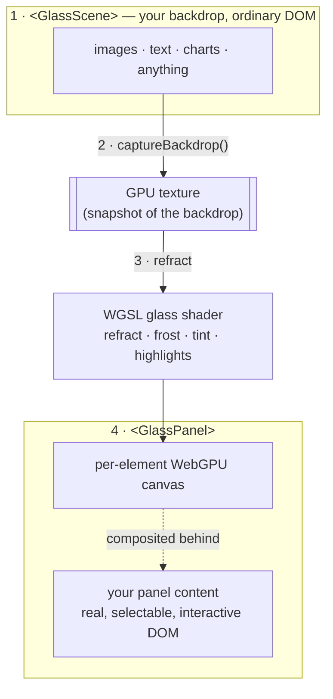

# Glaze

**Liquid glass UI for the web — write normal DOM, get GPU-rendered glass for free.**

**[▶ Live demo](https://stephenshorton.github.io/glaze/)** · MIT licensed · WebGPU (Chrome/Edge, Safari 26+), with a CSS-glass fallback everywhere else.



Glaze renders refractive "liquid glass" on the GPU while your text, links, inputs, focus, and accessibility stay **100% real DOM**. You write an ordinary component; Glaze snapshots whatever's behind your glass panel, refracts it with a WGSL shader, and renders your panel's content crisp on top — no textures, uniforms, capture, or render-loop code.

## Quick start

```svelte
<script>
  import { GlassScene, GlassPanel } from "@glaze/svelte";
  let temp = $state(64);
</script>

<GlassScene>
              <!-- backdrop: ordinary DOM -->
  <h1>anything here gets refracted</h1>

  <GlassPanel drag>                        <!-- "make this glass" -->
    <h2>San Francisco</h2> <span>{temp}°</span>
    <input type="range" bind:value={temp} />   <!-- crisp & interactive -->
    <a href="/forecast">7-day forecast →</a>
  </GlassPanel>
</GlassScene>
```

That's the whole surface. No WGSL, no `<canvas>`, no uniforms, no second copy of anything.

## How it works



1. **`<GlassScene>`** wraps your backdrop — ordinary DOM you already write.
2. Glaze snapshots that subtree into a **GPU texture** (`captureBackdrop()` — the native HTML-in-Canvas API where available, [html2canvas](https://github.com/niklasvh/html2canvas) otherwise).
3. **`<GlassPanel>`** mounts a per-element WebGPU canvas behind its content and runs a **WGSL glass shader** that refracts the texture (edge lensing, chromatic dispersion, frost, tint, specular highlights).
4. Your **panel content** stays real, selectable, interactive DOM on top. Panels are excluded from the capture, so the glass can never photograph itself (no feedback loop).

## Why not just render the whole UI on the GPU?

Because the moment you paint your UI to a canvas, you opt out of 20 years of browser platform work all at once — text shaping, accessibility (pixels are invisible to screen readers), IME, selection, find-in-page, autofill, links, SEO, native scrolling. Glaze keeps the **DOM authoritative** and uses the GPU strictly as an opt-in *paint* layer. Text and accessibility aren't "solved" — they're never removed. (Even Figma, Google Docs and Miro, who built the full bespoke GPU stack, are walking it back toward this hybrid.)

## Packages

| Package | What it is |
| --- | --- |
| [`@glaze/core`](packages/core) | Framework-agnostic engine: per-element WebGPU canvas, WGSL `paint(uv)` shaders, reactive uniforms, `@texture` support, backdrop capture, and a mandatory CSS fallback. |
| [`@glaze/svelte`](packages/svelte) | `<GlassScene>` / `<GlassPanel>` components, plus a low-level `use:shader` action. |

React/Vue/vanilla bindings are thin additions on top of the framework-agnostic core — not rewrites.

## Tuning a panel

Every `<GlassPanel>` prop is reactive and optional — bind them to state or a control panel and the glass updates live:

| Prop | Default | Effect |
| --- | --- | --- |
| `color` | `#e6ebf2` | glass color (drives the frost color + tint wash) |
| `blur` | `0` | **Frost**: `0` clear → CSS-style blur + powder → fully solid matte |
| `tint` | `0.04` | how much `color` washes the clear glass |
| `radius` | element's `border-radius` | corner radius |
| `refraction` | `0.05` | edge lensing strength |
| `dispersion` | `0.006` | chromatic split at the rim |
| `rim` | `0.05` | width of the refracting edge band |
| `specular` | `1` | highlight intensity |
| `drag` | `false` | make the panel draggable |

## Low-level: `use:shader`

`<GlassPanel>` is built on a primitive you can use directly — bind any WGSL `paint(uv) -> vec4f` shader to an element, with reactive uniforms:

```svelte
<script>
  import { shader } from "@glaze/svelte";
  let intensity = $state(0.6);
</script>

<section use:shader={{
  wgsl: `
    @uniform intensity: f32;
    fn paint(uv: vec2f) -> vec4f {
      let n = glaze_fbm(uv * 4.0 + globals.time * 0.1);
      return vec4f(vec3f(0.3, 0.5, 0.9) * n * u.intensity, 1.0);
    }`,
  uniforms: { intensity },
  fallback: { kind: "css", value: "#101426" },
}}>
  <h1>Real, selectable text over a live shader.</h1>
</section>
```

Built-ins available in every shader: `globals.{time,mouse,resolution,scroll,dpr}`; declare your own with `@uniform name: f32 | vec2f | vec3f | vec4f` and images with `@texture name`.

## Browser support & limits

- **WebGPU required** for the GPU path (Chrome/Edge, Safari 26+). Elsewhere, panels fall back to CSS `backdrop-filter` glass automatically.
- **Same-origin backdrops** (the html2canvas capture path can't read cross-origin images/iframes).
- **Static capture by default** — the backdrop is snapshotted once. Continuously-animating DOM backdrops are out of scope for v1 (use a `<video>`/`<canvas>` source for live pixels).

## Develop

```bash
npm install
npm run build       # build @glaze/core
npm run dev:demo    # http://localhost:5273
```

## License

[MIT](LICENSE)
